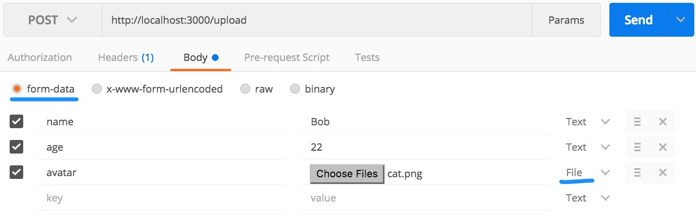

# Ví dụ hướng dẫn lập trình Express cùng với việc viết Unit Test
# body-parser middle ware 
Để parse được body gửi lên từ một post request
```javascript
const bodyParser = require("body-parser");
app.use(bodyParser.urlencoded({
  extended: true
}));
```

# Upload file
Sử dụng [multer](https://expressjs.com/en/resources/middleware/multer.html)
# Upload file sử dụng multer
```bash
yarn add multer --save
```

Đơn giản
```javascript
const upload = multer({ dest: 'uploads/' })
```
```javascript
app.post('/upsingle', app.upload.single('avatar'), function (req, res) {
    console.log(req.body) // form fields
    console.log(req.file) // form files
    res.send('Upload success');
  });
```


Bổ xung thêm cách lưu trữ file upload và hàm lọc file
```javascript
const storage = multer.diskStorage({
  destination: (req, file, cb) => {
    cb(null, 'uploads/')
  },
  filename: (req, file, cb) => {
    cb(null, shortid.generate() + '-' + file.originalname)
  }
});

function fileFilter(req, file, cb) {
  let ext = path.extname(file.originalname);
  if (ext === '.png' || ext === '.jpg') {
    cb(null, true)  //Success
  } else {
    cb(new Error(ext + ' is not accepted')) //Raise Error
    //cb(null, false) Silently pass by 
  }
}

app.upload = multer({storage: storage, fileFilter: fileFilter});
```



# Bắt lỗi trong middleware

Hãy viết hàm này sau cùng
```javascript
app.use(function (err, req, res, next) {
  console.error(err.stack)
  res.status(500).send(err.message);
})
```
# Sử dụng SuperTest
[SuperTest](https://www.npmjs.com/package/supertest) được dùng để kiểm thử HTTP server trong đó có Express

Cài đặt
```bash
yarn add supertest -D
```

# Tham khảo
[MAKE YOUR NODE.JS API BULLETPROOF: HOW TO TEST WITH MOCHA, CHAI, AND SUPERTEST](https://developmentnow.com/2015/02/05/make-your-node-js-api-bulletproof-how-to-test-with-mocha-chai-and-supertest/)